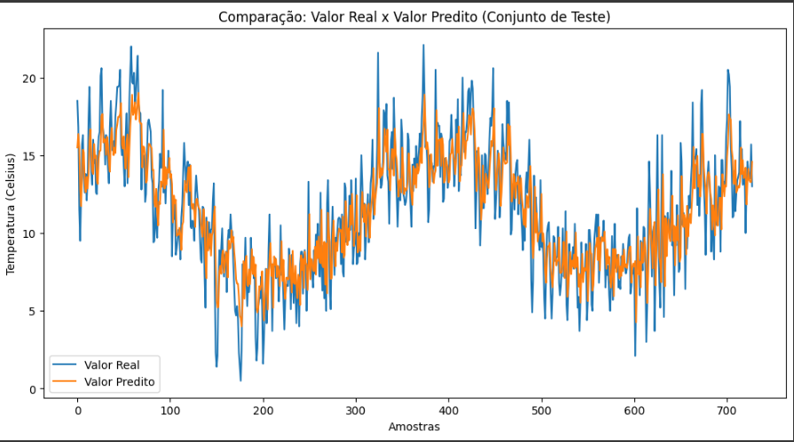

# Previsão de Série Temporal com RNN

## Visão Geral

Este projeto utiliza um dataset de série temporal obtido do [Kaggle](https://www.kaggle.com) para desenvolver um modelo de previsão baseado em Redes Neurais Recorrentes (RNN).

## Dataset

O dataset escolhido contém dados de série temporal, com as seguintes colunas (exemplo):

- **Data:** Registro temporal da observação.
- **Temperatura:** Medida capturada naquele dia.

## Métrica de Avaliação

Para este problema de regressão, utilizei o **MSE (Mean Squared Error)** como métrica de avaliação.

- O MSE penaliza fortemente erros maiores, o que é desejável em problemas onde grandes desvios podem afetar a qualidade da predição.
- Por ser uma métrica diferenciável, ela facilita a otimização durante o treinamento da rede.

## Implementação do Modelo

O modelo foi implementado utilizando uma arquitetura de RNN, que é especialmente adequada para dados sequenciais. As principais etapas do projeto incluem:

1. **Pré-processamento dos Dados:**

   - Conversão das datas para um formato adequado.
   - Normalização dos valores para facilitar o treinamento.
   - Criação de sequências para alimentar a RNN.
2. **Definição e Treinamento da RNN:**

   - Construção da arquitetura utilizando frameworks como TensorFlow.
   - Treinamento do modelo, monitorando a redução do MSE.
3. **Avaliação e Visualização dos Resultados:**

   - Cálculo do MSE no conjunto de teste.
   - Geração de um gráfico comparando os valores reais e os valores preditos.

## Resultados Obtidos

Durante o treinamento, foi observado uma redução consistente do MSE, indicando que a RNN aprendeu a capturar os padrões temporais dos dados. O gráfico abaixo exemplifica a comparação entre os valores reais e os valores preditos:

### Análise dos Resultados

- **Treinamento:** A diminuição gradual do MSE ao longo das épocas demonstra a capacidade do modelo de ajustar seus parâmetros para minimizar os erros de previsão.
- **Previsão:** A comparação entre os valores reais e preditos mostra que a RNN é capaz de acompanhar a tendência geral da série temporal. No entanto, podem existir discrepâncias em pontos de alta volatilidade, sugerindo a possibilidade de aprimoramento através de ajustes na arquitetura ou no pré-processamento dos dados.
